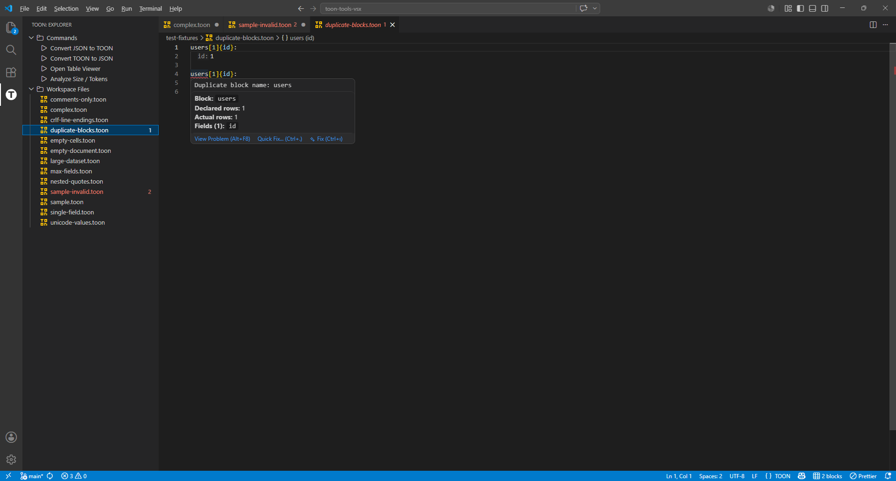
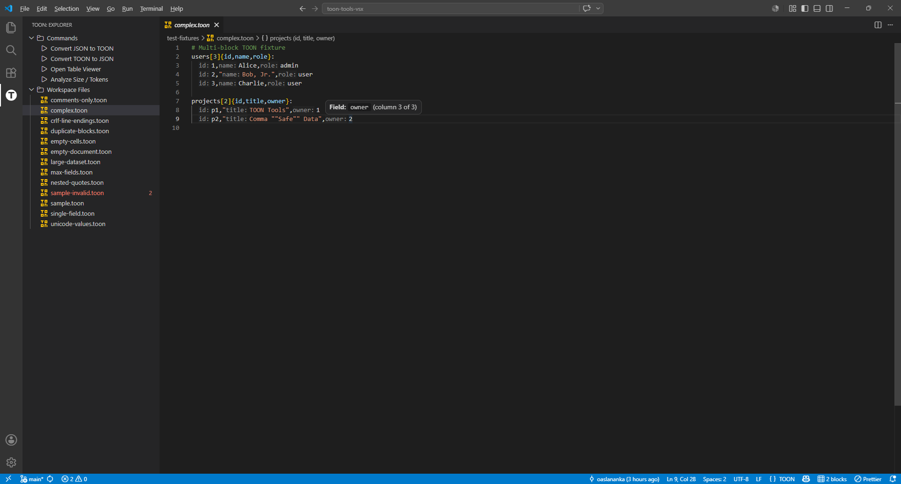
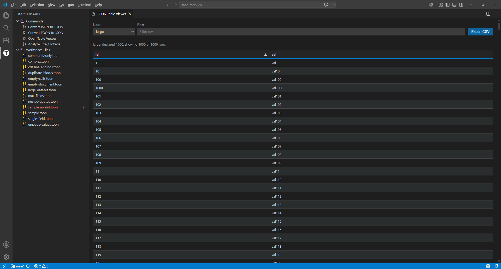
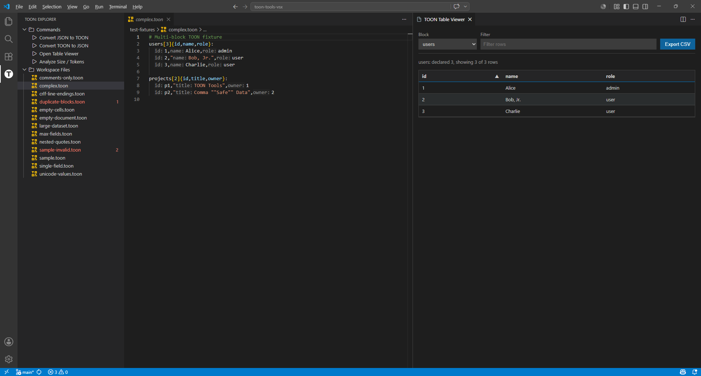

# TOON Tools for VS Code

[](https://marketplace.visualstudio.com/items?itemName=oaslananka.toon-tools-vsx)
[](https://open-vsx.org/extension/oaslananka/toon-tools-vsx)
[](https://github.com/oaslananka/toon-tools-vsx/actions/workflows/ci.yml)

> Token-Oriented Object Notation support: syntax highlighting, formatting, linting,
> intelligent editing, previews, table viewer, and dual-marketplace publishing.

TOON Tools turns `.toon` files into a first-class VS Code editing experience for compact
tabular data. It supports authoring, diagnostics, JSON conversion, data inspection, size analysis,
and CSV export without leaving the editor.

## Features

| Feature               | Description                                                                                                   |
| --------------------- | ------------------------------------------------------------------------------------------------------------- |
| Syntax highlighting   | TextMate grammar for block names, row counts, fields, comments, quoted strings, empty values, and separators. |
| Formatter             | Normalizes headers, row indentation, comma spacing, and trailing whitespace.                                  |
| Linter                | Reports row-count mismatches, duplicate fields, and rows with the wrong number of values.                     |
| Hover                 | Shows block metadata on headers and field names on data-row cells.                                            |
| Inlay hints           | Displays field-name hints before row values, controlled by `toon.inlayHints.enabled`.                         |
| Rename and definition | Rename block or field names from headers, and jump from rows back to the block header.                        |
| JSON conversion       | Convert JSON arrays or objects of arrays to TOON, and convert TOON back to JSON.                              |
| Table Viewer          | Inspect blocks as sortable, filterable tables in a VS Code-themed webview.                                    |
| Size Analyzer         | Compare TOON and JSON byte counts, line counts, and token estimates.                                          |
| CSV export            | Export any TOON block to a CSV file from the command palette or context menu.                                 |

## Preview

### Syntax Highlighting & Diagnostics



### Inlay Hints



### Table Viewer



### Editor and Table Preview



## Install

Install from the [VS Code Marketplace](https://marketplace.visualstudio.com/items?itemName=oaslananka.toon-tools-vsx)
or [Open VSX](https://open-vsx.org/extension/oaslananka/toon-tools-vsx). To install a local
VSIX build, run:

```bash
pnpm run package
code --install-extension ./toon-tools-vsx-<version>.vsix
```

## Usage

Open a `.toon` file to enable syntax highlighting, diagnostics, hover, inlay hints, formatting, and
navigation. Use the command palette for conversion, preview, table inspection, token-size analysis,
and CSV export commands.

## TOON Format Specification

TOON stores tabular records as named blocks:

```toon
users[3]{id,name,role}:
  1,Alice,admin
  2,Bob,user
  3,Charlie,user
```

Header syntax:

```text
BlockName[rowCount]{field1,field2,...}:
```

Rows are indented comma-separated values. Empty values are allowed. Double-quoted values may contain
commas, and embedded quotes are escaped by doubling them:

```toon
users[2]{id,name,note}:
  1,"Bob, Jr.","Says ""hello"""
  2,Alice,
```

Comments start with `#` when the line begins with optional whitespace. See
[docs/toon-spec.md](docs/toon-spec.md) for the complete grammar and examples.

## Configuration

| Setting                           | Default   | Description                                                     |
| --------------------------------- | --------- | --------------------------------------------------------------- |
| `toon.linter.enabled`             | `true`    | Enable real-time TOON linting.                                  |
| `toon.linter.debounceMs`          | `300`     | Debounce delay in milliseconds for linting on document changes. |
| `toon.formatter.indentWidth`      | `2`       | Number of spaces for row indentation. Allowed values: `2`, `4`. |
| `toon.formatter.fieldSpacing`     | `compact` | Header field separator style: `compact` or `spaced`.            |
| `toon.conversion.toJsonValueMode` | `strings` | TOON-to-JSON value mode: `strings` or `typed`.                  |
| `toon.inlayHints.enabled`         | `true`    | Show field-name inlay hints in data rows.                       |
| `toon.statusBar.enabled`          | `true`    | Show the current TOON block count in the VS Code status bar.    |

`.toonrc` files are validated against [schemas/toon-config.schema.json](schemas/toon-config.schema.json).

## Commands

| Command                          | Description                                                        | Default shortcut |
| -------------------------------- | ------------------------------------------------------------------ | ---------------- |
| `TOON: Convert JSON to TOON`     | Convert the active JSON document or selection into a TOON preview. | None             |
| `TOON: Convert TOON to JSON`     | Convert the active TOON document or selection into formatted JSON. | None             |
| `TOON: Open JSON Preview (side)` | Open a side-by-side JSON preview for the active TOON document.     | None             |
| `TOON: Open TOON Preview (side)` | Open a side-by-side TOON preview for the active JSON document.     | None             |
| `TOON: Open Table Viewer`        | Open the active TOON document in a sortable table viewer.          | None             |
| `TOON: Analyze Size / Tokens`    | Compare TOON and JSON byte counts and token estimates.             | None             |
| `TOON: Export Block as CSV`      | Export a selected TOON block to CSV.                               | None             |

## Extension Development

```bash
git clone https://github.com/oaslananka/toon-tools-vsx.git
cd toon-tools-vsx
corepack enable
pnpm install --frozen-lockfile
pnpm run build
```

Launch the extension with `F5` and the `Launch TOON Extension` configuration.

Useful local gates:

```bash
pnpm run format:check
pnpm run lint
pnpm run typecheck
pnpm run test:unit:coverage
pnpm run build
pnpm run package
```

Automation and scheduled repository checks are documented in
[docs/automation.md](docs/automation.md).

## Workspace Trust and Security

TOON Tools declares limited untrusted-workspace support. Linting, formatting, syntax highlighting,
hover, and inlay hints work in untrusted workspaces. The extension metadata marks conversion
commands as trust-sensitive because they read document content and can create derived documents.
Preview, table-viewer, size analysis, and CSV export commands also process active document content
and can create webviews or files; use them only for workspace content you trust.

Webviews use VS Code theme variables, `localResourceRoots`, a restrictive Content-Security-Policy,
and nonces generated with Node `crypto`.

## Known Limitations

This extension implements a strict TOON table-block subset. Quoted row values support commas and
escaped double quotes. TOON-to-JSON conversion keeps values as strings by default; opt into typed
primitive inference with `toon.conversion.toJsonValueMode`. JSON-to-TOON conversion expects arrays
of objects or objects containing arrays of objects, and object keys must be valid TOON block and
field names.

## Support

Open bugs, feature requests, and security-adjacent hardening requests in
[GitHub Issues](https://github.com/oaslananka/toon-tools-vsx/issues). For private vulnerability
reports, use GitHub private vulnerability reporting or a private security advisory.

## Contributing

See [docs/contributing.md](docs/contributing.md).

## License

MIT. See [LICENSE](LICENSE).
